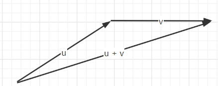
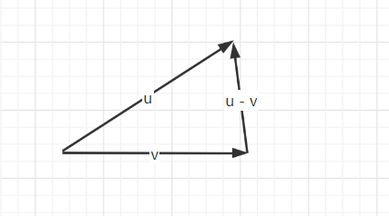
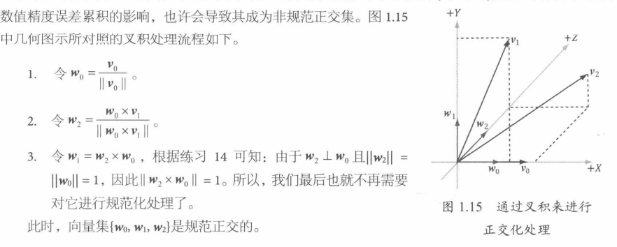

# 1. 定理

## 1. 向量

```mathematica
1. 向量: 具有大小和方向的量.

2. 向量与坐标系关系: 以原点[零向量](0, 0)/(0, 0, 0)作为起始点，那么(x, y)/(x, y, z)就可以表示一个向量.

3. 左手坐标系:(z指向页内). 右手坐标系:(z指向页外).

4. 单位向量: 大小为1的向量.

5. 点积/标量积: u(x1, y1, z1) · v(x2, y2, z2) = x1 * x2 + y1 * y2 + z1 * z2 
				= ||u|| * ||v|| * cosB(B为u,v的夹角)

6. 规范正交: 集合内的任一向量都与集合中的其他所有向量相互正交

7. 向量叉积: 

	1. 3D:  w与u,v彼此正交
		u(x1, y1, z1) x v(x2, y2, z2) = (y1 * z2 - y2 * z1, z1 * x2 - z2 * x1, x1y2 - x2y1) = w
	2. 2D(伪): u(x, y)与v(-y, x)正交
```

# 2. 推理

## 1. 向量

```mathematica
1. 向量相等: 大小和方向都要相等.

2. 由1.1.2, 推导向量加法: u + v = (x1, y1, z1) + (x2, y2, z2) = (x1 + x2, y1 + y2, z1 + z2).

3. 由1.1.2, 推导标量和向量的乘法: k * u = k * (x, y, z) = (kx, ky, kz).

4. 由2.1.2|2.1.3, 推导向量减法: u - v = u + -1 * (v) = (x1 - x2, y1 - y2, z1 - z2).

5. 由1.1.2, 推导向量的长度是: sqrt(x * x + y * y)/sqrt(x * x + y * y + z * z)

6. 由1.1.5, 推导出:
	
	1. 当u · v = 0，u垂直于v
	2. 当u · v > 0，u与v夹角为锐角
	3. 当u · v < 0，u与v夹角为钝角

7. 由1.1.4|1.1.5，推导出: 当向量v投影到单位向量n上就是正交投影

	=> ||v|| * ||n|| * cosB = ||v|| * cosB
```

<strong>补充:</strong>

1. **2.1.2: 加法图**

   

2. **2.1.4: 减法图**

   

3.  **2.1.7: 正交投影**

   

# 3. 应用

## 1. 正交化

### 1. **格拉姆 - 施密特正交化:**


### 2. 叉积正交化



